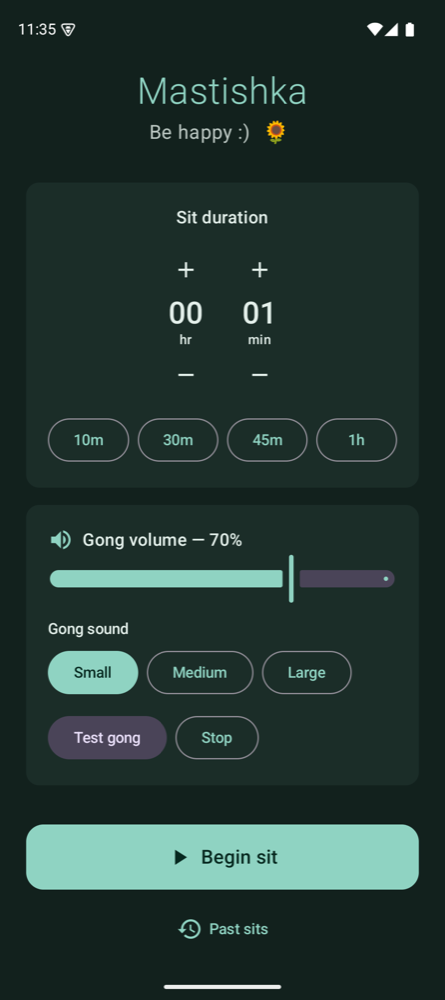
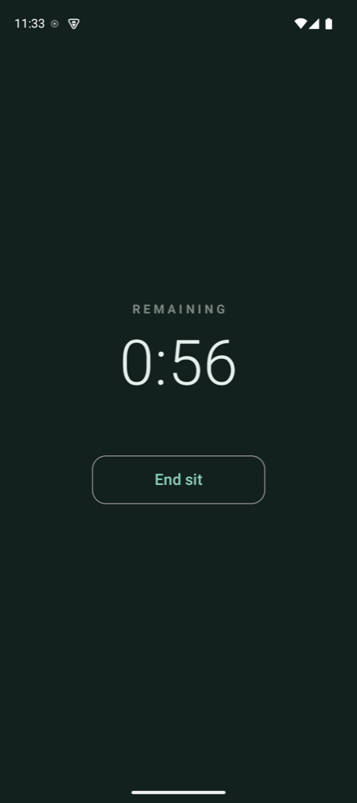
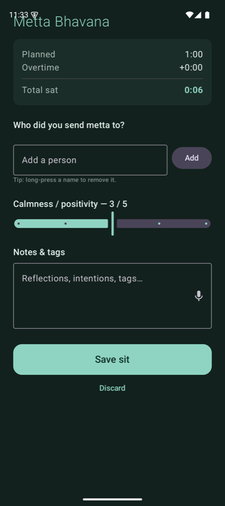
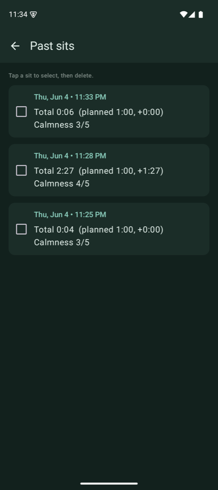

# Mastishka

A barebones Android app for Vipassana meditation sits.

- **Sit timer** — set a duration; at zero the **gong rings without interrupting you**, and the
  timer keeps counting *overtime* so you know exactly how much longer you sat.
- **Gong volume** and **gong sound** (Small / Medium / Large — default Medium) are set before
  the sit, with a **Test gong** button.
- **Metta Bhavana** at the end — pick people you sent loving-kindness to (reusable list),
  rate calmness/positivity, and add notes/tags (with **voice-to-text**).
- **History** of every sit (total/overtime, calmness, people, notes), stored on-device.

Native Kotlin + Jetpack Compose, Room (history), DataStore (settings), and a foreground
service + wake lock so the gong fires reliably even with the screen off.

`applicationId`: `nishparadox.mastishka` · `minSdk` 26 · `compileSdk` 35

## Screenshots

<p>
  
  
  
  
</p>

---

## Install on your phone (sideload)

The ready-to-install debug APK is **`mastishka.apk`** in this folder.

### Option A — drag-and-drop (no cable setup)
1. Copy `mastishka.apk` to your phone (AirDrop to a Mac won't work for Android; use Google
   Drive, email it to yourself, or a USB file transfer).
2. On the phone, tap the file. Android will ask to allow installing from this source — allow it.
3. Open **Mastishka**.

### Option B — over USB with adb (what was used to test)
1. On the phone: **Settings → About phone → tap "Build number" 7 times** to enable Developer
   Options, then **Settings → System → Developer options → enable "USB debugging"**.
2. Plug the phone into the Mac; accept the "Allow USB debugging" prompt on the phone.
3. From this folder:
   ```sh
   export ANDROID_HOME="$HOME/Library/Android/sdk"
   "$ANDROID_HOME/platform-tools/adb" install -r mastishka.apk
   ```

> First gong: grant the notification permission when prompted (it powers the ongoing-timer
> notification). The sit still runs without it.

---

## Rebuild from source

Tooling already installed on this machine:
- JDK 17: `~/.jdks/jdk-17.0.19+10/Contents/Home`
- Android SDK: `~/Library/Android/sdk`

```sh
export JAVA_HOME="$HOME/.jdks/jdk-17.0.19+10/Contents/Home"
export ANDROID_HOME="$HOME/Library/Android/sdk"

# Regenerate the gong sound (only needed if you change scripts/generate_gong.py)
python3 scripts/generate_gong.py

# Build the debug APK -> app/build/outputs/apk/debug/app-debug.apk
./gradlew :app:assembleDebug
```

## Run on the Pixel 9 emulator

```sh
export ANDROID_HOME="$HOME/Library/Android/sdk"
export ANDROID_SDK_ROOT="$ANDROID_HOME"

# Boot the emulator (AVD "pixel9" already created)
"$ANDROID_HOME/emulator/emulator" -avd pixel9 &

# Install + launch
"$ANDROID_HOME/platform-tools/adb" install -r app/build/outputs/apk/debug/app-debug.apk
"$ANDROID_HOME/platform-tools/adb" shell am start -n nishparadox.mastishka/.MainActivity
```

## Project layout

```
app/src/main/java/nishparadox/mastishka/
  MainActivity.kt              # screen flow + notification permission
  MeditationViewModel.kt       # settings, DB, timer state, test-gong playback
  service/TimerService.kt      # foreground clock, gong, wake lock, notification
  data/AppData.kt              # Room entities/DAOs/DB + DataStore settings
  ui/Screens.kt                # Setup / Sit / Metta / History composables
  ui/Theme.kt                  # Compose Material3 theme
app/src/main/res/raw/gong_{small,medium,large}.wav  # synthesized gongs (default: medium)
scripts/generate_gong.py       # bell/gong additive synthesis, 3 sizes (stdlib only)
```
